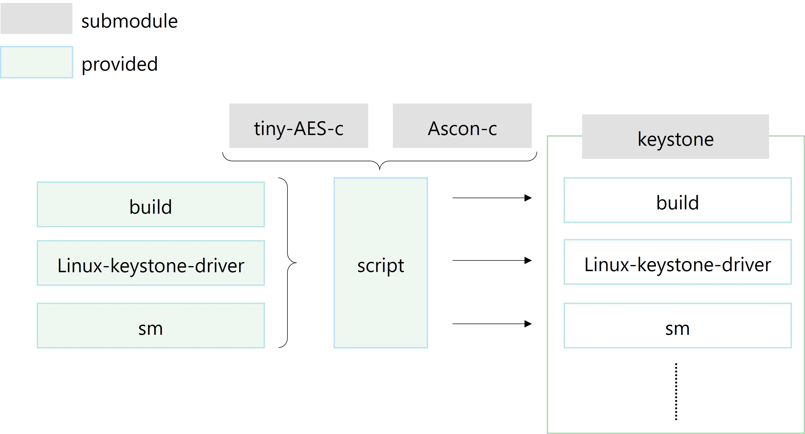

# Keystone-JAM

<!-- [English README is here](https://github.com/pyth0n14n/keystone_JAM/blob/main/README.md ) -->

このリポジトリは、RISC-V Keystoneにフォールトインジェクション攻撃対策を適用したものです。
特に、TCHES'22で提案したフォールトによるTEE (Trusted Execution Environment) バイパス攻撃への対策を提供します。
対策のメインは、TCHES'22で提案したジャンプアドレスマスキング (Jump Address Masking: JAM)です。
その他、フォールトによるTEEバイパス攻撃対策として、メモリ暗号化、ランダム遅延、命令複製(冗長化)も実装しています。

攻撃と対策の詳細は、[出版と引用](#出版と引用) に記載の論文を参照下さい。

## 提供物
本リポジトリでは、以下を提供します。
ライセンスを分けるため、既存モジュールと新規開発物を分けています。
既存モジュールをscriptが切り貼りしたり、パッチを適用したりすることで、Keystoneに対策が適用されます。

|フォルダ名|バージョン|説明|
|:--|:--|:--|
|tiny-AES-c| f06ac37f (commit) | メモリ暗号化で使用|
|ascon-c| v1.2.7| メモリ暗号化で使用|
|keystone| v1.0.0| RISC-VベースのTEE実装|
|build| - | メモリアクセスを行うサンプルプログラム (ホストアプリケーションhapp)|
|linux-keystone-driver| - |JAMのための機能拡張|
|sm| - | JAM及びその他の対策の実装 |
|script| - | 既存モジュールとパッチをもとに、keystoneに対策を適用|



## システム要件

### ハードウェア

KeystoneはQEMUでも動作するため、ハードウェアは必須ではありません。
SiFive Unleashedボードがあれば、実機で動作させることが可能です。

### ソフトウェア

ツールチェイン等はkeystoneにより提供されます。また、scriptはシェルスクリプトとpatchコマンドしか使用しないため、特別なソフトウェアは不要です。
ただし、keystoneを動作させる環境は必要です。詳細は、[Keystoneビルド](#2-keystoneビルド)を参照ください。

## 利用方法

### 流れ
1. 導入
2. Keystoneビルド
3. JAM適用
4. 実行

#### 1. 導入

```
$ git clone github.com/pyth0n14n/keystone-JAM
$ git submodule update --init
```

#### 2. Keystoneビルド
Keystoneをビルドする (QEMUで動作確認するところまで)。
詳細は、[公式ドキュメント](https://docs.keystone-enclave.org/en/latest/Getting-Started/index.html)参照。

以下、公式ドキュメントより抜粋。
初期設定
```
$ cd keystone
$ ./fast-setup.sh
```

ビルド
```
$ mkdir build
$ cd build
$ cmake .. -DLINUX_SIFIVE=y
$ make
$ make image
```

もしも、Ubuntu 22.04 LTSを使用していて、ビルドエラーが出る場合、[ビルドエラー対応](#ビルドエラー)を参照してください。

#### 3. JAM適用
パッチ適用
```
$ cd script
$ ./make_aes.sh
$ ./make_ascon.sh
$ ./make_example.sh
```
`make_example.sh`の実行中に操作を求められるので、指示に従い、別のコンソールから、`cmake ..` -> `make`を実行。そのあとで、`y (enter)`。
`$ ./apply_patch.sh`

my-exampleのビルド&配置
```
$ cd keystone/build/my-example/build
$ cmake ..
$ make victim
$ cp hello-native/hello-native.ke ../../overlay/root/victim.ke
```

イメージの再ビルド
```
$ cd keystone/build
$ make
$ make image
```

#### 4. 実行
```
$ cd keystone/build
$ ./scripts/run-qemu.sh
```

### 動作確認

検証環境
|項目 | 内容 |バージョン| 備考|
|:--|:--|:--|:--|
|OS  | Pop!_OS| 22.04 LTS| Ubuntuベース|

下記の例では、victim.keを実行し、次を検証します。
1. 不正なメモリアクセスなしで正常動作すること
2. eapp領域にアクセスして拒否されること

victim.keは、happとeappが結合されたプログラムです。happは、アドレスを受け取り、そのアドレスのデータをメモリダンプします。eappは、共有メモリに'hello world'というデータを入れます。
QEMU上での実行結果は以下です。ポイントは、以下です。
1. `[SM-custom] JAM implemented`より、JAMが実装されていることが確認できる。
2. 検証1の実行結果は正常終了する。
3. `pmp_unset() [hart 0]: reg[1], mode[NAPOT], range[0xb9200000-0xb9400000], perm[xxx]`より、eappでは、物理メモリ0xb9200000-0xb9400000の領域が保護される。
4. 検証2の実行時のアクセス先アドレス0xb9210000はeapp内である。そのため、`cause: 0000000000000005`のとおり、load access faultで例外処理される。
5. その時のpmpcfgでの保護設定は、`[sbi_sm_stop_enclave] mepc ffffffe00080435a, cfg0 1f00000000001818, addr7 ffffffffffffffff`より、cfg0 = 0x...18.. = 0b11000: AAXWR -> アドレスマッチング NAPOT, XWR=000=disableである
```
./scripts/run-qemu.sh
**** Running QEMU SSH on port 3893 ****
overriding secure boot ROM (file: /home/nashimoto/RISCV/verify/keystone-JAM/keystone/build/bootrom.build/bootrom.bin)
boot ROM size: 53869
fdt dumped at 57968

OpenSBI v0.8
   ____                    _____ ____ _____
  / __ \                  / ____|  _ \_   _|
 | |  | |_ __   ___ _ __ | (___ | |_) || |
 | |  | | '_ \ / _ \ '_ \ \___ \|  _ < | |
 | |__| | |_) |  __/ | | |____) | |_) || |_
  \____/| .__/ \___|_| |_|_____/|____/_____|
        | |
        |_|
...
[SM-custom] DEBUG PRINT on
[SM-custom] QEMU on
[SM-custom] JAM implemented
...
<<login process>>
# insmod keystone-driver.ko
# ./victim.ke  # exec w/o memory dump
Verifying archive integrity... MD5 checksums are OK. All good.
Uncompressing Keystone Enclave Package
changed: 24-02-21 v5
[happ] main@0x210fa
[ecall_keystone_handler] extid: 8424b45, funcid: 2001d, mepc: ffffffe000804356
[sm] create
...
hello-native, eyrie-rt, (null)
...
addr is NULL
Enclave said: "Hello World"
...
pmp_unset() [hart 0]: reg[1], mode[NAPOT], range[0xb9200000-0xb9400000], perm[xxx]
# ./victim.ke 0xb9210000  # access to eapp
...
hello-native, eyrie-rt, 0xb9210000
...
[sbi_sm_stop_enclave] mepc ffffffe00080435a, cfg0 1f00000000001818, addr7 ffffffffffffffff
address 0xffffffffb9210000@0x3fc1e39000
[  141.126089] hello-native-ru[261]: unhandled signal 11 code 0x2 at 0x00000000000213a2 in hello-native-runner[20000+d000]
[  141.127193] CPU: 0 PID: 261 Comm: hello-native-ru Tainted: G           O      5.7.0-dirty #5
[  141.127519] epc: 00000000000213a2 ra : 000000000002136c sp : 0000003fffdf28c0
[  141.127751]  gp : 0000000000028264 tp : 0000003fc1e3cb40 t0 : 0000003fc1e39000
[  141.127981]  t1 : 0000000000000000 t2 : 0000000000000010 s0 : 0000003fffdf2920
[  141.128211]  s1 : 00000000000263ba a0 : 000000000000000d a1 : 00000000b9210000
[  141.128441]  a2 : 0000000000000028 a3 : 0000000000000001 a4 : 0000003fc1e39000
[  141.128672]  a5 : 0000003fc1e39000 a6 : 0000003fc1e9922c a7 : 0000000000000040
[  141.128902]  s2 : 0000000000000000 s3 : 0000000000000000 s4 : 0000000000000000
[  141.129132]  s5 : 00000000000d3190 s6 : 0000000000000000 s7 : ffffffffffffffff
[  141.129362]  s8 : 00000000000ff760 s9 : 0000000000108860 s10: 00000000000fe010
[  141.129594]  s11: 0000000000000000 t3 : 0000000000000000 t4 : 0000000000000000
[  141.129824]  t5 : 0000003fffdf23a0 t6 : 0000003fffdf23d0
[  141.129998] status: 0000000000004020 badaddr: 0000003fc1e39000 cause: 0000000000000005
 ...
```

ビルド設定を変更し、JAM無しで、TEEバイパス攻撃シミュレーションを行ったときの結果は以下です。
ポイントは以下です。
1. `[SM-custom]`より、JAMが実装されていないことが分かる
2. `[sbi_sm_stop_enclave] mepc ffffffe00080435a, cfg0 1f00000000001f18, addr7 ffffffffffffffff`より、cfg0 = 0x...1f.. = 0b11111: AAXWR -> アドレスマッチング NAPOT, XWR=111=enableである（これがTEEバイパス攻撃）。
3. happ起動時にeappへのアクセス権限が得られた結果、メモリダンプに成功し、正常終了する。
```
./scripts/run-qemu.sh
...
[SM-custom] DEBUG PRINT on
[SM-custom] QEMU on
[SM-custom] SIM FAULT implemented
...
# ./victim.ke 0xb9210000
...
[sbi_sm_stop_enclave] mepc ffffffe00080435a, cfg0 1f00000000001f18, addr7 ffffffffffffffff
address 0xffffffffb9210000@0x3fda8fd000
0xb9210000: 2e4800cf 00000000
0xb9210010: 2e4804cf 00000000
0xb9210020: 2e4808cf 00000000
0xb9210030: 2e480ccf 00000000
0xb9210040: 2e4810cf 00000000
0xb9210050: 2e4814cf 00000000
0xb9210060: 2e4818cf 00000000
0xb9210070: 2e481ccf 00000000
Enclave said: "Hello World"
...
```

### 対策の切り替え
keystoneフォルダ下のconf.hファイルの書き換えで対策等のビルド設定を切り替えることができます。
設定変更後は、`$ make` & `$ make image`にて再ビルド下さい。

conf.hは4つあります：
| path               | #define |
|:--|:--|
| sm/conf.h | 省略 |
| linux-keystone-driver/conf.h | JAM, DEBUG_PRINT |
| build/my-example/hello-native/conf.h | JAM, QEMU|
| build/my-example/build/hello-native<br>/runtime/src/eyrie-hello-native-eyrie/conf.h|JAM

設定値は以下のとおりです：
|#define | 説明 |
|:-------|:---|
|**対策**|-|
|JAM     | Jump Address Masking|
|MEM_ENC | AESによるメモリ暗号化|
|MEM_ENC_ASCON | Asconによるメモリ暗号化|
|RND_DELAY | ランダム遅延|
|DUPL | 命令複製(冗長化) |
|**攻撃**|-|
|SW_FAULT | TEEバイパス攻撃のシミュレーション |
|EXPLOIT | 実機でのフォールトを用いたTEEバイパス攻撃|
|EXPLOIT_UNMASK | 実機でのJAMのアンマスクへの攻撃 (SW_FAULTがデフォルトで有効) |
|EXPLOIT_ENC| 実機でのメモリ暗号化への攻撃 (SW_FAULTがデフォルトで有効)|
|**計測**|-|
|CALC_CONTEXT_SWITCH_OVERHEAD| コンテキストスイッチの処理時間計測のためのトリガ処理|
|SILENT | 上記計測のために不要なprint処理を削除|
|**ユーティリティ**| -|
|DEBUG_PRINT | デバッグ目的のプリント処理|
|QEMU | QEMU実行する場合は有効化|

**注意1：EXPLOITではGPIOを使ったトリガ生成を行うため、QEMUでこのオプションを使用すると動作しません。**
**注意2：対策の重ね掛けは動作検証していません。**

例）JAMを無効化して、TEEバイパス攻撃を模擬する場合の設定：QEMU, SW_FAULT (, DEBUG_PRINT)

### アプリケーション変更
基本的には、my-exampleのプログラムを変更ください。
デフォルトアプリケーションtests.keをJAM下で動かすには、1) .ldsによるエントリーポイント固定 と 2) eyrieのジャンプ処理のラッパー化が必要になります。my-exampleを参考にしてください。

## 出版と引用

コードの一部でもお役に立ちましたら、引用いただけると幸甚です。
JAMの説明については、下記の論文もご参照下さい。

```bibtex
@article{nashimoto2022bypassing,
  title={Bypassing Isolated Execution on RISC-V using Side-Channel-Assisted Fault-Injection and Its Countermeasure},
  author={Nashimoto, Shoei and Suzuki, Daisuke and Ueno, Rei and Homma, Naofumi},
  journal={IACR Transactions on Cryptographic Hardware and Embedded Systems},
  pages={28--68},
  year={2022}
}

@inproceedings{nashimoto2024,
  author={Nashimoto, Shoei and Ueno, Rei and Homma, Naofumi},
  title = {Comparative Analysis and Implementation of Jump Address Masking for Preventing TEE Bypassing Fault Attacks},
  year = {2024},
  publisher = {Association for Computing Machinery},
  address = {New York, NY, USA},
  url = {https://doi.org/TBD},
  doi = {TBD},
  booktitle = {Proceedings of the 19th International Conference on Availability, Reliability and Security},
  series = {ARES '24}
}

@online{nashimoto2024keystonejam,
  title={Keystone-JAM: RISC-V Keystone with the countermeasure JAM against TEE bypassing fault attacks},
  author={Nashimoto, Shoei},
  year={2024},
  publisher={GitHub},
  url={https://github.com/pyth0n14n/keystone-JAM},
}
```

## 補足
ビルドエラー対応
- c-stack.c
```
c-stack.c:55:26: error: missing binary operator before token "("
   55 | #elif HAVE_LIBSIGSEGV && SIGSTKSZ < 16384```
```
->
  [リンク](https://launchpad.net/ubuntu/+archive/primary/+sourcefiles/m4/1.4.18-5ubuntu1/m4_1.4.18-5ubuntu1.debian.tar.xz)よりパッチ(04-fix-sigstksz.patch) をダウンロード ([出典](https://stackoverflow.com/questions/74999961/c-error-missing-binary-operator-before-token))。
  ```
  $ cd keystone_end/build/buildroot.build/build/host-m4-1.4.18/lib
  $ patch -u < 04-fix-sigstksz.patch
  ```

- libfakeroot.c
```
libfakeroot.c:102:50: error: ‘_STAT_VER’ undeclared (first use in this function)
  102 | #define INT_NEXT_FSTATAT(a,b,c,d) NEXT_FSTATAT64(_STAT_VER,a,b,c,d)`
```
->
  ファイル(keystone/buildroot.build/build/host-fakeroot-1.25.3/libfakeroot.c)を直接編集する ([出典](https://lists.fedoraproject.org/archives/list/devel@lists.fedoraproject.org/message/SMQ3RYXEYTVZH6PLQMKNB3NM4XLPMNZO/))。
>--- a/src/libfakechroot.h
>+++ b/src/libfakechroot.h
>@@ -224,4 +224,14 @@ int fakechroot_try_cmd_subst (char *, const char *, char *);
> int snprintf(char *, size_t, const char *, ...);
> #endif
>+#ifndef _STAT_VER
>+#if defined (__aarch64__)
>+#define _STAT_VER 0
>+#elif defined (__x86_64__)
>+#define _STAT_VER 1
>+#else
>+#define _STAT_VER 3
>+#endif
>+#endif
>+
> #endif
