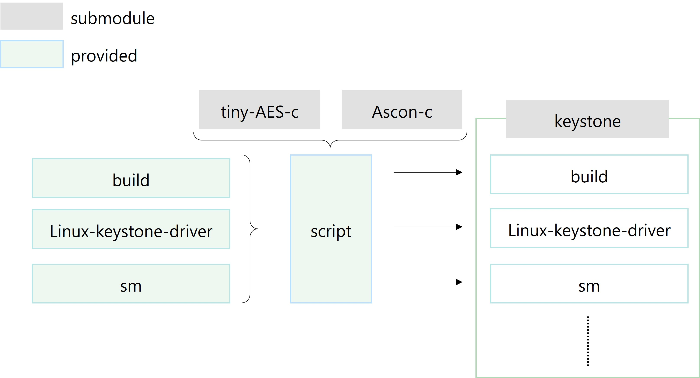

# Keystone-JAM

[日本語の README はこちら](https://github.com/pyth0n14n/keystone-JAM/blob/main/README-ja.md )

This repository applies fault injection attack countermeasures to RISC-V Keystone.
Specifically, it provides countermeasures against TEE (Trusted Execution Environment) bypass attacks using fault injection, proposed at TCHES'22.
The main countermeasure is Jump Address Masking (JAM) proposed at TCHES'22.
Additionally, it implements memory encryption, random delays, and instruction duplication (redundancy) as countermeasures against TEE bypass attacks.

For details on the attacks and countermeasures, please refer to the papers listed in the [Publication and Citation](#Publication-and-Citation) section.

## Deliverables
This repository provides the following:
To separate licenses, existing modules and newly developed items are separated.
Scripts are used to piece together existing modules and apply patches, thus applying countermeasures to Keystone.

| Folder Name          | Version         | Description                                         |
|:---------------------|:----------------|:----------------------------------------------------|
| tiny-AES-c           | f06ac37f (commit) | Used for memory encryption                          |
| ascon-c              | v1.2.7          | Used for memory encryption                          |
| keystone             | v1.0.0          | RISC-V based TEE implementation                     |
| build                | -               | Sample program that performs memory access (host application (happ)) |
| linux-keystone-driver| -               | Extensions for JAM                                  |
| sm                   | -               | Implementation of JAM and other countermeasures     |
| script               | -               | Applies countermeasures to keystone based on existing modules and patches |



## System Requirements

### Hardware
Keystone can run on QEMU, so hardware is not essential.
However, if you have a SiFive Unleashed board, it can be run on actual hardware.

### Software
The toolchain and other requirements are provided by Keystone. The scripts only use shell scripts and the patch command, so no special software is required.
However, an environment to run Keystone is necessary. For details, refer to [Keystone Build](#2-build-keystone).

## Usage

### Flow
1. Setup
2. Build Keystone
3. Apply JAM
4. Execute

#### 1. Setup

```sh
$ git clone github.com/pyth0n14n/keystone-JAM
$ git submodule update --init
```

#### 2. Build Keystone
Build Keystone (up to running on QEMU).
Refer to the [official documentation](https://docs.keystone-enclave.org/en/latest/Getting-Started/index.html) for details.

Excerpt from the official documentation:
Initial setup
```sh
$ cd keystone
$ ./fast-setup.sh
```

Build
```sh
$ mkdir build
$ cd build
$ cmake .. -DLINUX_SIFIVE=y
$ make
$ make image
```

If you encounter build errors when using Ubuntu 22.04 LTS, refer to [Build Error Handling](#supplement).

#### 3. Apply JAM
Apply patches
```sh
$ cd script
$ ./make_aes.sh
$ ./make_ascon.sh
$ ./make_example.sh
```
During the execution of `make_example.sh`, you will be prompted for input. Follow the instructions, run `cmake ..` and then `make` from another console. After that, press `y (enter)`.
```sh
$ ./apply_patch.sh
```

Build & Deploy my-example
```sh
$ cd keystone/build/my-example/build
$ cmake ..
$ make victim
$ cp hello-native/hello-native.ke ../../overlay/root/victim.ke
```

Rebuild image
```sh
$ cd keystone/build
$ make
$ make image
```

#### 4. Execute
```sh
$ cd keystone/build
$ ./scripts/run-qemu.sh
```

### Verification

Test environment
| Item | Description | Version | Remarks |
|:-----|:------------|:--------|:--------|
| OS   | Pop!_OS     | 22.04 LTS| Based on Ubuntu |

In the example below, execute victim.ke and verify the following:
1. Normal operation without illegal memory access
2. Access to the eapp area is denied

The victim.ke program is a combination of happ and eapp. The happ receives an address and dumps the memory data at that address. The eapp puts the data "hello world" in shared memory.
The results of running on QEMU are as follows. Key points are:
1. `[SM-custom] JAM implemented` confirms that JAM is implemented.
2. The result of verification 1 completes successfully.
3. `pmp_unset() [hart 0]: reg[1], mode[NAPOT], range[0xb9200000-0xb9400000], perm[xxx]` shows that the eapp protects the physical memory range 0xb9200000-0xb9400000.
4. The access address 0xb9210000 during verification 2 is within the eapp. Therefore, as indicated by `cause: 0000000000000005`, it is handled as a load access fault.
5. The protection setting in the pmpcfg at that time is shown by `[sbi_sm_stop_enclave] mepc ffffffe00080435a, cfg0 1f00000000001818, addr7 ffffffffffffffff`, where cfg0 = 0x...18.. = 0b11000: AAXWR -> address matching NAPOT, XWR=000=disable.
```
./scripts/run-qemu.sh
**** Running QEMU SSH on port 3893 ****
overriding secure boot ROM (file: /home/nashimoto/RISCV/verify/keystone-JAM/keystone/build/bootrom.build/bootrom.bin)
boot ROM size: 53869
fdt dumped at 57968

OpenSBI v0.8
   ____                    _____ ____ _____
  / __ \                  / ____|  _ \_   _|
 | |  | |_ __   ___ _ __ | (___ | |_) || |
 | |  | | '_ \ / _ \ '_ \ \___ \|  _ < | |
 | |__| | |_) |  __/ | | |____) | |_) || |_
  \____/| .__/ \___|_| |_|_____/|____/_____|
        | |
        |_|
...
[SM-custom] DEBUG PRINT on
[SM-custom] QEMU on
[SM-custom] JAM implemented
...
# insmod keystone-driver.ko
# ./victim.ke  # exec w/o memory dump
Verifying archive integrity... MD5 checksums are OK. All good.
Uncompressing Keystone Enclave Package
changed: 24-02-21 v5
[happ] main@0x210fa
[ecall_keystone_handler] extid: 8424b45, funcid: 2001d, mepc: ffffffe000804356
[sm] create
...
hello-native, eyrie-rt, (null)
...
addr is NULL
Enclave said: "Hello World"
...
pmp_unset() [hart 0]: reg[1], mode[NAPOT], range[0xb9200000-0xb9400000], perm[xxx]
# ./victim.ke 0xb9210000  # access to eapp
...
hello-native, eyrie-rt, 0xb9210000
...
[sbi_sm_stop_enclave] mepc ffffffe00080435a, cfg0 1f00000000001818, addr7 ffffffffffffffff
address 0xffffffffb9210000@0x3fc1e39000
[  141.126089] hello-native-ru[261]: unhandled signal 11 code 0x2 at 0x00000000000213a2 in hello-native-runner[20000+d000]
[  141.127193] CPU: 0 PID: 261 Comm: hello-native-ru Tainted: G           O      5.7.0-dirty #5
[  141.127519] epc: 00000000000213a2 ra : 000000000002136c sp : 0000003fffdf28c0
[  141.127751]  gp : 0000000000028264 tp : 0000003fc1e3cb40 t0 : 0000003fc1e39000
[  141.127981]  t1 : 0000000000000000 t2 : 0000000000000010 s0 : 0000003fffdf2920
[  141.128211]  s1 : 00000000000263ba a0 : 000000000000000d a1 : 00000000b9210000
[  141.128441]  a2 : 0000000000000028 a3 : 0000000000000001 a4 : 0000003fc1e39000
[  141.128672]  a5 : 0000003fc1e39000 a6 : 0000003fc1e9922c a7 : 0000000000000040


[  141.128902]  s2 : 0000000000000000 s3 : 0000000000000000 s4 : 0000000000000000
[  141.129132]  s5 : 00000000000d3190 s6 : 0000000000000000 s7 : ffffffffffffffff
[  141.129362]  s8 : 00000000000ff760 s9 : 0000000000108860 s10: 00000000000fe010
[  141.129594]  s11: 0000000000000000 t3 : 0000000000000000 t4 : 0000000000000000
[  141.129824]  t5 : 0000003fffdf23a0 t6 : 0000003fffdf23d0
[  141.129998] status: 0000000000004020 badaddr: 0000003fc1e39000 cause: 0000000000000005
 ...
```

The result of the TEE bypass attack simulation without JAM by changing the build settings is as follows.
Key points are:
1. `[SM-custom]` shows that JAM is not implemented.
2. `[sbi_sm_stop_enclave] mepc ffffffe00080435a, cfg0 1f00000000001f18, addr7 ffffffffffffffff` shows cfg0 = 0x...1f.. = 0b11111: AAXWR -> address matching NAPOT, XWR=111=enable (this is a TEE bypass attack).
3. Since access rights to eapp were obtained when starting happ, the memory dump succeeds, and it completes normally.
```sh
./scripts/run-qemu.sh
...
[SM-custom] DEBUG PRINT on
[SM-custom] QEMU on
[SM-custom] SIM FAULT implemented
...
# ./victim.ke 0xb9210000
...
[sbi_sm_stop_enclave] mepc ffffffe00080435a, cfg0 1f00000000001f18, addr7 ffffffffffffffff
address 0xffffffffb9210000@0x3fda8fd000
0xb9210000: 2e4800cf 00000000
0xb9210010: 2e4804cf 00000000
0xb9210020: 2e4808cf 00000000
0xb9210030: 2e480ccf 00000000
0xb9210040: 2e4810cf 00000000
0xb9210050: 2e4814cf 00000000
0xb9210060: 2e4818cf 00000000
0xb9210070: 2e481ccf 00000000
Enclave said: "Hello World"
...
```

### Switching Countermeasures
You can switch build settings such as countermeasures by modifying the *conf.h* file under the keystone folder.
After changing the settings, please rebuild using `$ make` & `$ make image`.

There are four conf.h files:
| Path               | #define |
|:-------------------|:--------|
| sm/conf.h          | *omitted* |
| linux-keystone-driver/conf.h | JAM, DEBUG_PRINT |
| build/my-example/hello-native/conf.h | JAM, QEMU|
| build/my-example/build/hello-native<br>/runtime/src/eyrie-hello-native-eyrie/conf.h|JAM

The settings are as follows:
| #define             | Description                            |
|:--------------------|:---------------------------------------|
| **Countermeasures** |-                                        |
| JAM                 | Jump Address Masking                    |
| MEM_ENC             | Memory encryption using AES             |
| MEM_ENC_ASCON       | Memory encryption using Ascon           |
| RND_DELAY           | Random delays                           |
| DUPL                | Instruction duplication (redundancy)    |
| **Attacks**         |-                                        |
| SW_FAULT            | Simulation of TEE bypass attack         |
| EXPLOIT             | TEE bypass attack using actual faults   |
| EXPLOIT_UNMASK      | Attack on JAM unmasking using actual faults (SW_FAULT is enabled by default) |
| EXPLOIT_ENC         | Attack on memory encryption using actual faults (SW_FAULT is enabled by default) |
| **Measurements**    |-                                        |
| CALC_CONTEXT_SWITCH_OVERHEAD | Trigger processing for measuring context switch processing time |
| SILENT              | Removes unnecessary print processing for the above measurement |
| **Utilities**       |-                                        |
| DEBUG_PRINT         | Print processing for debugging purposes |
| QEMU                | Enable when running on QEMU             |

**Note 1: EXPLOIT uses GPIO to generate triggers, so this option will not work on QEMU.**

**Note 2: Stacking multiple countermeasures has not been verified for operation.**

Example: Setting to disable JAM and simulate TEE bypass attacks: QEMU, SW_FAULT (, DEBUG_PRINT)

### Application Changes
Basically, modify the my-example program.
To run the default application tests.ke under JAM, 1) fixing the entry point with .lds and 2) wrapping the jump processing of eyrie are required. Refer to my-example.

## Publication and Citation

If any part of the code was helpful, please cite it.
For a description of JAM, please also refer to the following papers.

```bibtex
@inproceedings{nashimoto2024comparative,
  author={Nashimoto, Shoei and Ueno, Rei and Homma, Naofumi},
  title = {Comparative Analysis and Implementation of Jump Address Masking for Preventing TEE Bypassing Fault Attacks},
  year = {2024},
  publisher = {Association for Computing Machinery},
  address = {New York, NY, USA},
  url = {https://doi.org/10.1145/3664476.3664477},
  doi = {10.1145/3664476.3664477},
  booktitle = {Proceedings of the 19th International Conference on Availability, Reliability and Security},
  series = {ARES '24}
}

@article{nashimoto2022bypassing,
  title={Bypassing Isolated Execution on RISC-V using Side-Channel-Assisted Fault-Injection and Its Countermeasure},
  author={Nashimoto, Shoei and Suzuki, Daisuke and Ueno, Rei and Homma, Naofumi},
  journal={IACR Transactions on Cryptographic Hardware and Embedded Systems},
  pages={28--68},
  year={2022}
}

@online{nashimoto2024keystonejam,
  title={Keystone-JAM: RISC-V Keystone with the countermeasure JAM against TEE bypassing fault attacks},
  author={Nashimoto, Shoei},
  year={2024},
  publisher={GitHub},
  url={https://github.com/pyth0n14n/keystone-JAM},
}
```

---
## Supplement
Build Error Handling
- c-stack.c
```sh
c-stack.c:55:26: error: missing binary operator before token "("
   55 | #elif HAVE_LIBSIGSEGV && SIGSTKSZ < 16384
```
->
Download the patch (04-fix-sigstksz.patch) from [link](https://launchpad.net/ubuntu/+archive/primary/+sourcefiles/m4/1.4.18-5ubuntu1/m4_1.4.18-5ubuntu1.debian.tar.xz) ([source](https://stackoverflow.com/questions/74999961/c-error-missing-binary-operator-before-token)).
```sh
$ cd keystone_end/build/buildroot.build/build/host-m4-1.4.18/lib
$ patch -u < 04-fix-sigstksz.patch
```

- libfakeroot.c
```sh
libfakeroot.c:102:50: error: ‘_STAT_VER’ undeclared (first use in this function)
  102 | #define INT_NEXT_FSTATAT(a,b,c,d) NEXT_FSTATAT64(_STAT_VER,a,b,c,d)
```
->
Directly edit the file (keystone/buildroot.build/build/host-fakeroot-1.25.3/libfakeroot.c) ([source](https://lists.fedoraproject.org/archives/list/devel@lists.fedoraproject.org/message/SMQ3RYXEYTVZH6PLQMKNB3NM4XLPMNZO/)).
```
--- a/src/libfakechroot.h
+++ b/src/libfakechroot.h
@@ -224,4 +224,14 @@ int fakechroot_try_cmd_subst (char *, const char *, char *);
 int snprintf(char *, size_t, const char *, ...);
 #endif
+#ifndef _STAT_VER
+#if defined (__aarch64__)
+#define _STAT_VER 0
+#elif defined (__x86_64__)
+#define _STAT_VER 1
+#else
+#define _STAT_VER 3
+#endif
+#endif
+
 #endif
>>>>>>> 538cbec (update README)
```
